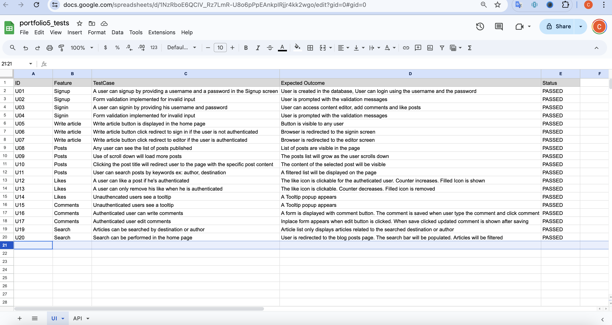

# Traveller's Diary

Traveller's Diary is a blog which contains articles about travel destinations.These articles were written by travellers.

 
The live link can be found here [Live Link](https://travellers-diary-0c3253b73ff3.herokuapp.com)
 

## The Strategy Plane

### Site Goals

Traveller's Diary is a blog website where travelers can share their experiences,tips and recommendations.In order to help other travellers to plan their next trip.

### Agile Planning

This project was developed using agile methodologies by delivering small features in incremental sprints. There were 3 sprints in total, spaced out evenly over three weeks.

All stories were assigned to epics, prioritized under the labels, Must have, should have, could have and assigned to sprints. "Must have" stories were completed first, "should haves" and then finally "could haves".
The Kanban board was created using github projects and can be located [Project board](https://github.com/users/chathugaj/projects/3) and can be viewed to see more information on the project cards.Only user stories have acceptance critieria to define the certain excecution.

## Epics

**Project management**

This Epic covers all the initial setup of the React application and dependencies in order to begin coding features.

**Content creation**

This epic covers the front end creation of the blog website in regards to posts. This is to allow users to interact with the backend API via the user interface in order to create, read, update and delete their own posts.

**Content Creation/View content**

This epic covers the front end creation of the blog website in regards to comments and likes on posts. This is to allow users to interact with the backend API in order add comments and likes on posts.

**User sign up**

This epic covers the front end creation of the blog website in regards to user profiles. This is to allow users to interact with the backend API via the user interface to manage their own profiles.

**Contact us**
This epic covers report content and how to get help from support.

**Search**
This epic covers the front end creation of the blog website in regards to user searching the article.

**Navigation**
This epic covers the front end creation of the blog website in regards to user navigate between blog posts,signin,signup and contact us pages.

**Authorization/Authentication**
This epic covers the front end creation of the blog website in regards to user signin and signup.

 

## User Stories

By Epic:

**Project management**

- As a developer, I want to create a documentation for the project, so that others can read and understand the concepts.
- As a developer I want my application deployed in heroku, so that users can start using it.

**Content creation**

- As a user I want to create and publish my articles, so that I can share my experience with other fellow travelers .
- As a user I want to create and manage my comments on posts.

**View content**

- As a user I want to read posts on the website, so that I can enjoy the other traverllers experience.
- As a user I want to read comments on a post on the website, so that I can see related experience from other travellers.
- As a user I want to see the latest three posts in the home page.

**User sign up**

- As a user I want to view my profile detials, so that I can verify the details are up to date.
- As a user I want to view other user profiles, so that I can get to know the other users.
- As a User I want to create my profile by signing up in the system.
- As a User I want to edit my profile, so that I an keep my details up to date.

**Contact us**

- As a user I want a contact us page, so that I can report issues or misconduct of other users.

**Search**

- As a user I want to be able to search the artcles with the content, so that I can view articles with certain keywods in the title.

**Navigation**

- As a user I want to navgate through main pages of the system quickly, so that I can perform tasks I want easily.

**Authorization/Authentication**

- As an authenticated user only, I can access the article editor, so that I can write articles.
- As an authenticted user only, I can comment on articles, so that I can share my thoughts on a post.
- As an authenticated user only, I can access the article editor, so that I can write articles.
- As an authenticted user only, I can comment on articles, so that I can share my thoughts on a post.

## The Structure Plane

## Features:

**Sign in**

User Story:

- As a user I can sign in with my username and password, so that I can have access to the content writer features of the blog.

Implementation:

**Search**
User Story:

- As a user I want to be able to search the artcles with the content, so that I can view articles with certain keywods in the title.

Implementation: [Filter by keyword]

**Content Creation**
User Story:
As a user I want to create and publish my articles, so that I can share my experience with other fellow travelers.

Implementation: [Content creation]

**Content view**
User Story:
\*As a user I want to read posts on the website, so that I can enjoy the other traverllers experience.
Implementation: [Blog posts page]

Implementation: [Home page with recent articles]

**Authentication**
User Story:
\*As an authenticted user only, I can comment on articles, so that I can share my thoughts on a post.
Implementation: [Unauthenticated]

User Story:
\*As an authenticated user only, I can access the article editor, so that I can write articles.
Implementation: 

**Comments**
User Story:
\*As a user I want to read comments on a post on the website, so that I can see related experience from other travellers.
Implementation: [Write article is clickable]

User Story:
\*As a user I want to create and manage my comments on posts.
Implementation: [Edit and delete comments]

**Profile**

User Story:
\*As a User I want to edit my profile, so that I an keep my details up to date.

User Story:
\*As a user I want to view my profile detials, so that I can verify the details are up to date.

Implementation: [Profile]

 

### Future Features

\*As a future feature,I would like to add google map area and image gallery.

 

## The Skeleton Plane

### Wireframes

All Wireframe Images

\*Designed the wire frame with figma.

## The Surface Plane

### Design

#### Colour-Scheme

Color scheme: black, white and red as main colors
Icons are used appropriately on buttons to indicate the function and improve the user experience. Bootstrap icons were used in the website.

https://icons.getbootstrap.com/

 

#### Typography

The main font used on the website is _Open Sans_

 

#### Imagery

Images used in the site are free with attribution, taken from https://www.pexels.com/

 

## Technologies

- React
  - Main framework used to create the user interface https://react.dev/
- Heroku
  - Used for application hosting
- Github
  - Repository used to store base code and docs

 

## Testing

esting was performed manually after creating a test matrix

 

## Deployment

## Heroku Deployment

The site was deployed to Heroku. The steps to deploy are as follows:

- Navigate to heroku and create an account
- Click the new button in the top right corner
- Select create new app
- Enter app name
- Select region and click create app
- Click the resources tab and search for Heroku Postgres
- Select hobby dev and continue

- Click the deploy tab
- Scroll down to Connect to GitHub and sign in / authorize when prompted
- In the search box, find the repositoy you want to deploy and click connect
- Scroll down to Manual deploy and choose the main branch
- Click deploy

 
The live link can be found here: [Live Site - Traveller's Diary](https://travellers-diary-0c3253b73ff3.herokuapp.com/)

## Version Control

The site was created using the Visual Studio Code editor and pushed to github to the remote repository ‘Traveller’s Diary.

https://github.com/chathugaj/travellers-diary

The following git commands were used throughout development to push code to the remote repo:

`git add <file>` - This command was used to add the file(s) to the staging area before they are committed.

`git commit -m “commit message”` - This command was used to commit changes to the local repository queue ready for the final step.

`git push` - This command was used to push all committed code to the remote repository on github.

 

### Run Locally

Navigate to the GitHub Repository you want to clone to use locally:

- Click on the code drop down button
- Click on HTTPS
- Copy the repository link to the clipboard
- Open your IDE of choice (git must be installed for the next steps)
- Type git clone copied-git-url into the IDE terminal

The project will now have been cloned on your local machine for use.

Install Dependencies:

`npm install`

Run Application:

`npm start`

 

### Forking

Forks can be used to either propose changes to someone else's project or to use the project as a starting point for your own idea.

Navigate to the GitHub Repository you want to fork.

On the top right of the page under the header, click the fork button.

This will create a duplicate of the full project in your GitHub Repository.

 

## Credits

React code references: https://github.com/mr-fibonacci/moments
Infinite scrolling: https://www.npmjs.com/package/react-infinite-scroll-component
Banner image: https://www.pexels.com/

### Content

Main reference used in during the development.

https://docs.djangoproject.com/en/4.2/

https://axios-http.com/docs/intro

https://learn.codeinstitute.net/courses/course-v1:CodeInstitute+DRF+2/courseware

### BUGS and ISSUES

- A TypeError error appears in the console, which I was unsuccessful to find the origination point.
  

- Browser displays a thirdparty cookie warning, indicating thirdparty cookies will be blocked in a future release. This could potentially break the website.
  

 

# Acknolwledgements

- Special thanks goes to Sara and Roman in tutor support for taking time and helping out to fix the CORS and login issues I had in the project.
- Special thanks to [Gareth McGirr](https://github.com/Gareth-McGirr) for mentoring and advice on various aspects of the project and helping out to solve issues.
